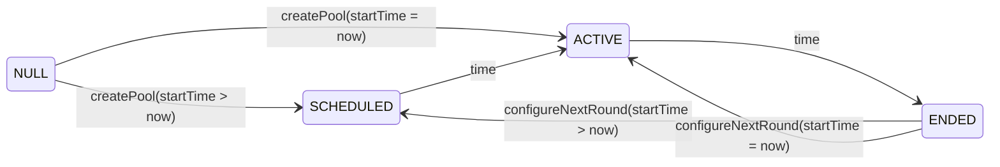

# Architecture

## Overview

The Sablier Staking protocol distributes rewards to users over time who stake ERC20 tokens in staking pools. The
protocol supports two types of staking:

1. **Direct ERC20 Token Staking**: Users can directly stake ERC20 tokens.
2. **Lockup NFT Staking**: Users can stake Sablier Lockup NFTs that are streaming the supported staking token.

The protocol implements a snapshot-based reward calculation mechanism.

## Notation

| Symbol  | Description                             |
| ------- | --------------------------------------- |
| $e$     | Event such as stake, claim rewards etc. |
| $T$     | Time elapsed between events             |
| $A_g$   | Total amount staked globally            |
| $A_u$   | Amount staked by user                   |
| $rpt_g$ | Global rewards per token                |
| $rpt_u$ | User's rewards per token                |
| $R_g$   | Total global rewards distributed        |
| $R_u$   | Total rewards earned by a user          |

## Technical Design

### 1. Snapshot-Based Reward System

The protocol uses a snapshot mechanism to calculate user rewards:

#### Global Snapshots

It tracks cumulative rewards distributed per token. The cumulative rewards per token at event $e$ is calculated as:

```math
rpt_g(e) = rpt_g(e-1) + \frac{\text{rewards distributed in period } [e-1, e]}{A_g(e)}
```

Where the rewards distributed in period $[e-1, e]$ is:

```math
\text{rewards distributed} = \frac{\text{total pool rewards} \cdot T}{\text{reward period}}
```

So, the total rewards distributed until $e$ becomes

```math
R_g = \sum_e rpt_g(e) \cdot A_g(e)
```

Of course, by the end of the reward period, $R_g$ must become equal to the pool rewards.

#### User Snapshots

It tracks rewards earned by each user using the global rewards distributed per token.

Now, to calculate user rewards, we first calculate rewards per token distributed since the last time user snapshot was
taken.

```math
\delta (rpt_u) = rpt_g(e) - rpt_u(e_{last})
```

When a user performs an action at event $e$, their pending rewards can be calculated as:

```math
\text{pending rewards} = \delta (rpt_u) \cdot A_u (e)
```

The user's total claimable rewards become:

```math
R_u(e) = R_u(e_{last}) + \text{pending rewards}
```

### 2. Dual Staking Model

#### Direct ERC20 Staking

- Users stake tokens directly to the contract
- Rewards earned on the amount staked

#### Lockup NFT Staking

- Users stake stream NFTs into the contract
- Rewards earned on the total tokens in the stream (including both locked and unlocked)
- Prevents withdrawal from staked streams
- Handles stream cancellation events

### 3. Other Considerations

- **Scaling Factor**: Amounts are scaled to 1e20 decimals for higher precision during divisions, preventing precision
  loss in reward calculations regardless of the token decimals.
- **No Staking**: No rewards are distributed when no tokens are staked

## Diagrams

### Statuses

| Status      | Description                                                   |
| ----------- | ------------------------------------------------------------- |
| `SCHEDULED` | When start time is in the future.                             |
| `ACTIVE`    | When current timestamp is in between start time and end time. |
| `ENDED`     | When end time is in the past.                                 |

### Statuses diagram



### Function calls

```mermaid
flowchart LR
    subgraph Statuses
        NULL((NULL)):::grey
        ACTIVE((ACTIVE)):::green
        SCHEDULED((SCHEDULED)):::yellow
        ENDED((ENDED)):::red
    end

    subgraph Functions
        CLAIM_REWARDS([claimRewards])
        CONFIGURE([configureNextRound])
        CREATE([createPool])
        SNAPSHOT([updateRewards])
        STAKE([stakeERC20Token / stakeLockupNFT])
        UNSTAKE([unstakeERC20Token / unstakeLockupNFT])
    end

    ALL((  )):::black
    AS((  )):::black

    classDef black fill:#000000,stroke:#333,stroke-width:2px;
    classDef green fill:#32cd32,stroke:#333,stroke-width:2px;
    classDef grey fill:#b0b0b0,stroke:#333,stroke-width:2px;
    classDef yellow fill:#ffff99,stroke:#333,stroke-width:2px;
    classDef red fill:#ff4e4e,stroke:#333,stroke-width:2px;

    ALL --> ACTIVE & SCHEDULED & ENDED
    AS --> ACTIVE & SCHEDULED

    CREATE  --> NULL

    CONFIGURE -- "Update Rewards" -->  ENDED

    CLAIM_REWARDS -- "Update Rewards" -->  ALL

    SNAPSHOT -- "Update Rewards" -->  ALL

    STAKE -- "Update Rewards" -->  AS

    UNSTAKE -- "Update Rewards" -->  ALL
```


